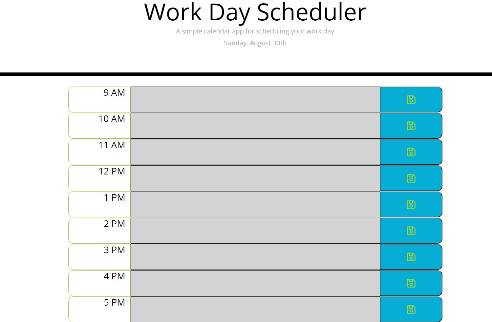
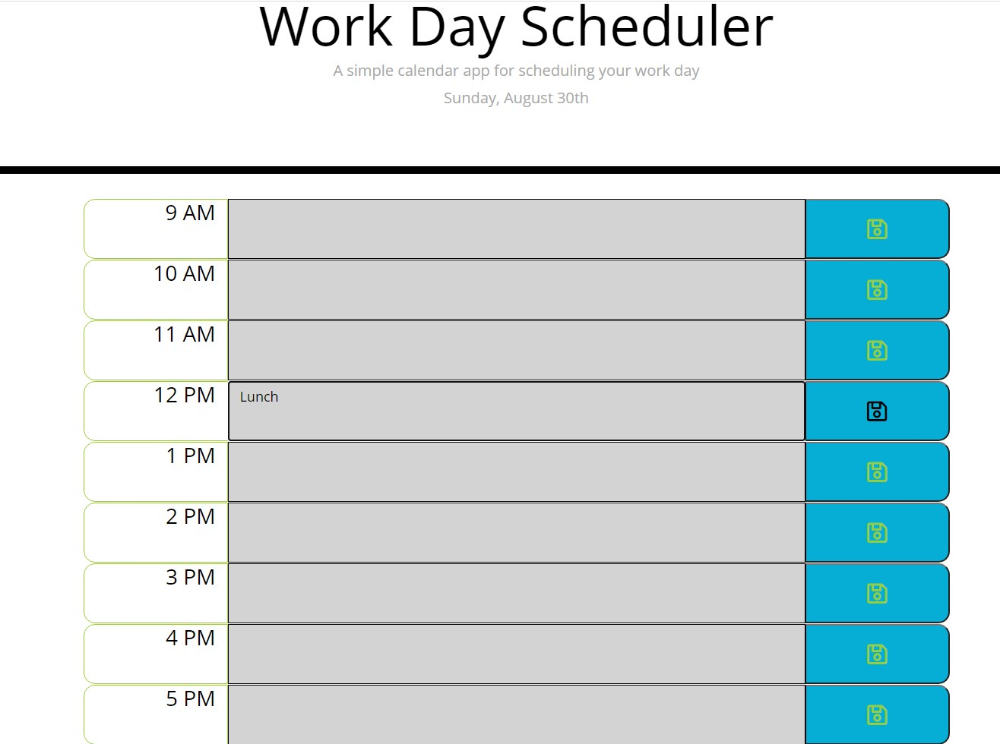

# Work Day Scheduler

It's important to keep your work day organized. This simple application can help!

## Specifications
```
 *Current date is displayed under header
 *Time blocks for standard business hours are color coded to indicated if they're in the past(gray), present(red), or future(green).
 *Text can be entered into time blocks
 *If save button on right side is pushed, then that event is saved to local storage
 *On page refresh, the saved tasks will repopulate
```
### Screenshots



### Deployed App
https://willsan0723.github.io/work-day-scheduler/
